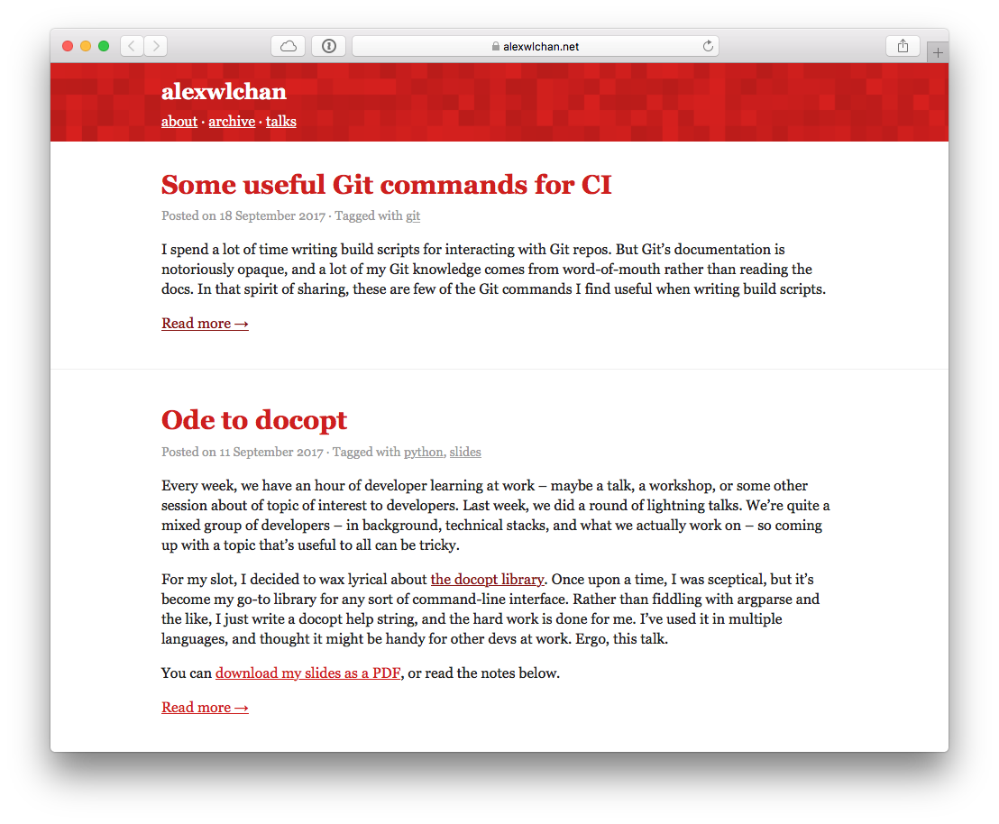

# alexwlchan.net

This repo has the code for my personal site, [alexwlchan.net][root].
It's a static site built with [Jekyll][jekyll], with a number of plugins written to suit my personal tastes.

The site is built and tested by [Travis][travis].
When I push to master, Travis uploads a copy of the rendered HTML files to a [Linode VPS][linode], where they're served by [nginx][nginx].



[root]: https://alexwlchan.net
[jekyll]: https://jekyllrb.com/
[travis]: https://travis-ci.org/
[linode]: https://www.linode.com/?r=ba2e6ce21e0c63952a7c74967ea0b96617bd44a3
[nginx]: https://nginx.org/

## Getting started

You need Git, make and Docker installed.

To run a local copy of the site:

```console
$ git clone git@github.com:alexwlchan/alexwlchan.net.git
$ make serve
```

The site should be running on <http://localhost:5757>.
If you make changes to the source files, it will automatically update.

To build a one-off set of static HTML files:

```console
$ make build
```
