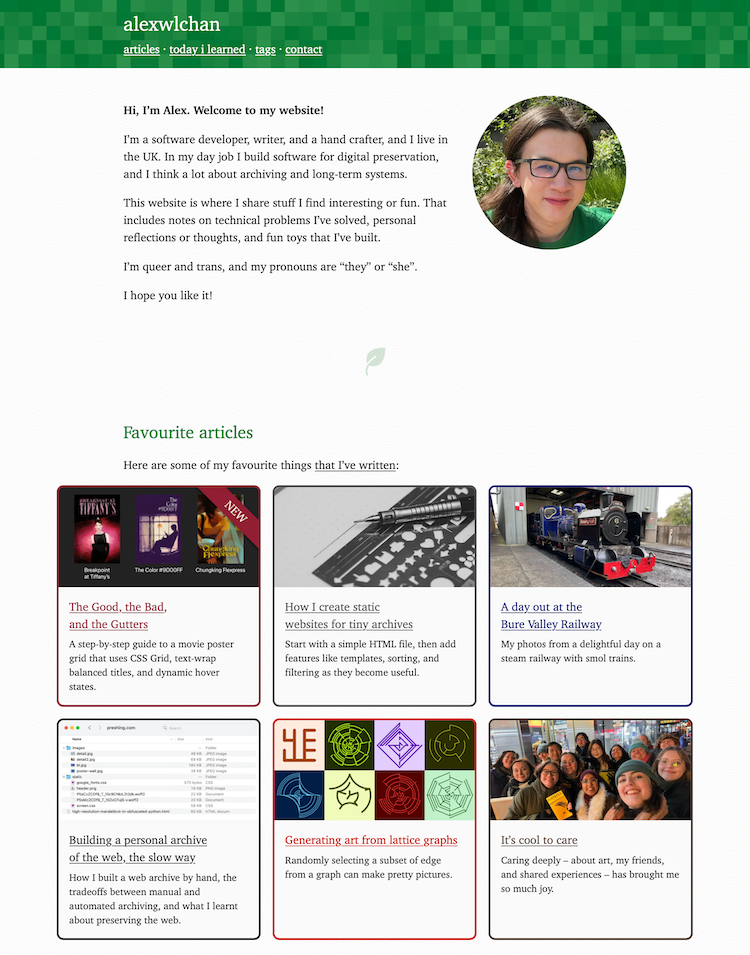

# alexwlchan.net

[](https://github.com/alexwlchan/alexwlchan.net/actions/workflows/build_site.yml)

This repo has the code for my personal site, [alexwlchan.net][root], which is a static site built with my own Python scripts*.*



This is a static website: I write pages in Markdown, and they get compiled to HTML using Mosaic, a static site generator I wrote in Python.
They get deployed to a server running at Linode, which runs [Caddy] as its web server.

I publish the source code so other people can see how the site works, and maybe use some of the ideas for their own sites.

[root]: https://alexwlchan.net
[Caddy]: https://caddyserver.com/


## Building the site

You need Git and Python installed.

To run a local copy of the site:

```console
$ git clone git@github.com:alexwlchan/alexwlchan.net.git
$ uv venv .venv
$ uv pip sync requirements.txt
$ python3 scripts/serve_site.py
```

The site should be running on <http://localhost:5757>.
If you make changes to the source files, it will automatically update.

To build a one-off set of static HTML files:

```console
$ python3 scripts/build_site.py
```

This creates a set of HTML files in `_out`.


## Contributing

This is my personal website, so I'm not looking for feature requests or major contributions.

I'd love to get bug reports, especially about accessibility issues, browser rendering inconsistencies, and general usability feedback.
I'm also happy to receive pull requests with typo fixes.

If you want to use any of the components in your own projects – plugins, layouts, stylesheets – feel free to do so.


## License

-   Except where otherwise noted, the site and the associated code are dual-licensed as:

    -   [Creative Commons Attribution 4.0 International (aka CC&nbsp;BY&nbsp;4.0)](https://creativecommons.org/licenses/by/4.0/)
    -   [The MIT License](https://opensource.org/licenses/MIT)

    If you're reusing my content, you can use whichever licence is most appropriate.

    Mostly the CC&nbsp;BY is fine, but Creative Commons licenses [aren't suitable for code][cc_code], so I have MIT as an alternative.

-   Some images that are being used under Creative Commons licenses from other people; see the post where an image is used for attribution.

-   All the icons on the site are used under a royalty-free license from [The Noun Project]; there should be comments in the SVG files indicating their source.
    The original icon authors retain copyright.

[cc_code]: https://wiki.creativecommons.org/index.php/Frequently_Asked_Questions#Can_I_apply_a_Creative_Commons_license_to_software.3F
[The Noun Project]: https://thenounproject.com/pricing/
