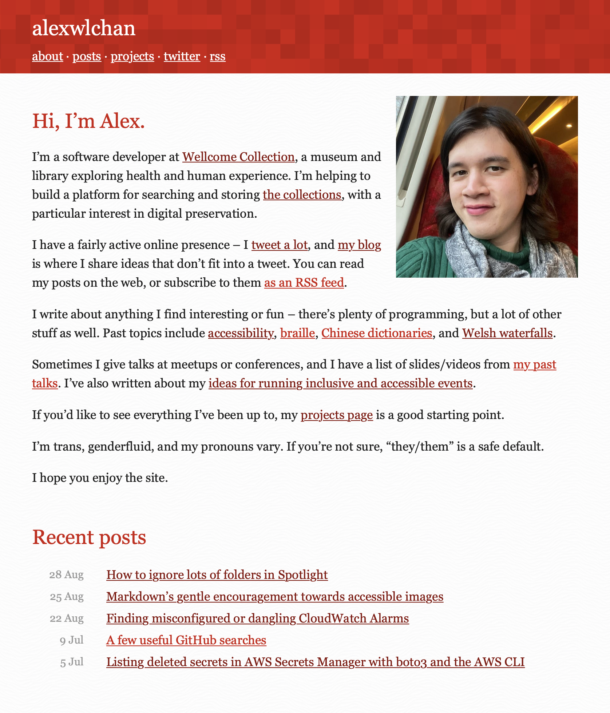

# alexwlchan.net

[](https://dev.azure.com/alexwlchan/alexwlchan/_build?definitionId=1&_a=summary)

This repo has the code for my personal site, [alexwlchan.net][root], which is a static site build with [Jekyll][jekyll].
It includes a number of plugins I've written to customise the site.



[root]: https://alexwlchan.net
[jekyll]: https://jekyllrb.com/
[azure]: https://dev.azure.com/alexwlchan/alexwlchan/_build
[linode]: https://www.linode.com/?r=ba2e6ce21e0c63952a7c74967ea0b96617bd44a3
[nginx]: https://nginx.org/


## Key tools

The site uses:

*   [Jekyll][jekyll], which generates the HTML pages
*   [Sass][sass], for building the CSS and stylesheets
*   [nginx][nginx], an HTTP server
*   [Docker][docker], which wraps the local build process and nginx on my server
*   [Azure Pipelines][azure], which builds and publishes the site
*   [Linode][linode], who provide the Linux server where I run nginx (referral link)
*   [Let's Encrypt][letsencrypt] for SSL/TLS certificates

When I want to make a change, I open a pull request.
This triggers a build with Azure Pipelines, and as part of the build it checks the HTML with [HTMLProofer].
This checks for missing alt text, broken links, invalid HTML, and so on.

If the site passes checks, it's [automatically merged by GitHub Actions][automerge], and the build on the `live` branch publishes the change to my web server.

[jekyll]: https://jekyllrb.com/
[sass]: https://sass-lang.com/
[nginx]: https://nginx.org/
[docker]: https://www.docker.com/
[azure]: https://azure.microsoft.com/en-us/services/devops/pipelines/
[linode]: https://www.linode.com/?r=ba2e6ce21e0c63952a7c74967ea0b96617bd44a3
[letsencrypt]: https://letsencrypt.org
[HTMLProofer]: https://github.com/gjtorikian/html-proofer
[automerge]: https://github.com/alexwlchan/auto_merge_my_pull_requests


## Building the site

You need Git, make and Docker installed.

To run a local copy of the site:

```console
$ git clone git@github.com:alexwlchan/alexwlchan.net.git
$ make serve
```

The site should be running on <http://localhost:5757>.
If you make changes to the source files, it will automatically update.

To build a one-off set of static HTML files:

```console
$ make build
```

This creates a set of HTML files in `_site`.


## How the site works

I publish the source code so other people can see how the site works, and maybe use some of the ideas for their own sites.
This is a list of things that I think are interesting or unusual:

*   [Builds in Docker](docs/builds-in-docker.md)
*   [Atom feed generation](docs/atom-feed-generation.md)
*   [Stylesheets and other theming settings](docs/stylesheets.md)
*   [Month and year archives](docs/month-and-year-archives.md)
*   [No-JavaScript Twitter embeds](docs/twitter-embeds.md)
*   [Linking to my work on other sites](docs/linking-to-other-work.md)


## Contributing

Fixes for typos are welcome, but otherwise contributions will be ignored.

If you want to use any of the components in your own projects – plugins, layouts, stylesheets – feel free to do so.


## License

The footer of the website says:

> Prose is CC-BY licensed, code is MIT.

That's because this is a mixture of prose content (blog posts) and code (both the repo itself, and code I write about).
I like CC-BY for the prose content, but Creative Commons licenses [aren't suitable for code][cc_code], so for that I use the same MIT license I do for my other open-source code.

[cc_code]: https://wiki.creativecommons.org/index.php/Frequently_Asked_Questions#Can_I_apply_a_Creative_Commons_license_to_software.3F
