# The Noun Project

I have a [NounPro subscription][subscriptions], which gives me a [royalty-free license][license] to use icons from the Noun Project.

That license means I don't have to attribute the icons, but this is an (possibly incomplete) list of icons I'm using, for my own tracking purposes.

<table>
  <tr>
    <td>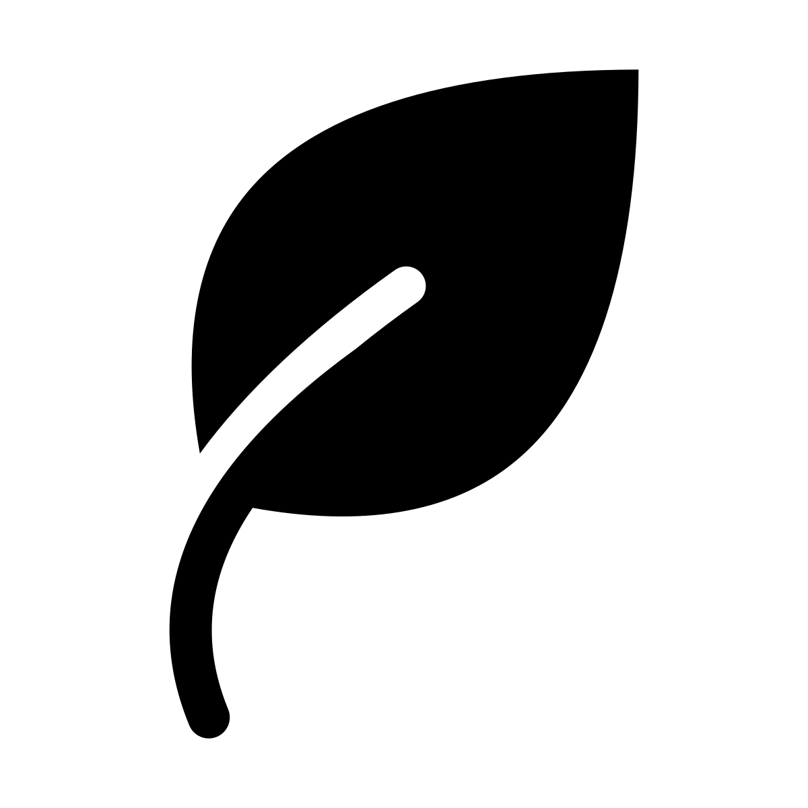</td>
    <td><a href="https://thenounproject.com/icon/leaf-5077343/">Leaf</a>, by SUCI UTOMO</td>
  </tr>

  <tr>
    <td>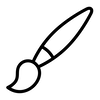</td>
    <td><a href="https://thenounproject.com/icon/paintbrush-2861542/">Paintbrush</a>, by nawicon</td>
  </tr>

  <tr>
    <td>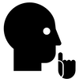</td>
    <td><a href="https://thenounproject.com/icon/silence-1585/">Silence</a>, by Yo Szczepanska</td>
  </tr>

  <tr>
    <td>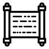</td>
    <td><a href="https://thenounproject.com/icon/holy-scripture-625542/">Holy Scripture</a>, by H Alberto Gongora</td>
  </tr>

  <tr>
    <td></td>
    <td><a href="https://thenounproject.com/icon/test-4700947/">test</a>, by H Gregor Cresnar</td>
  </tr>

  <tr>
    <td>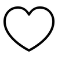</td>
    <td><a href="https://thenounproject.com/icon/heart-585522/">heart</a>, by creative outlet</td>
  </tr>

  <tr>
    <td>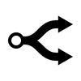</td>
    <td><a href="https://thenounproject.com/icon/fork-60030/">fork</a>, by Dmitry Baranovskiy</td>
  </tr>

  <tr>
    <td>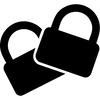</td>
    <td><a href="https://thenounproject.com/icon/padlock-2059429/">padlock</a>, by gufron m</td>
  </tr>

  <tr>
    <td>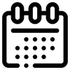</td>
    <td><a href="https://thenounproject.com/icon/calendar-3669219/">Calendar</a>, by Mada Creative</td>
  </tr>

  <tr>
    <td>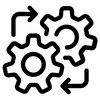</td>
    <td><a href="https://thenounproject.com/icon/process-2473979/">process</a>, by Alice Design</td>
  </tr>

  <tr>
    <td>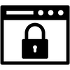</td>
    <td><a href="https://thenounproject.com/icon/browser-private-4286370/">browser private</a>, by Anwar Hossain</td>
  </tr>

  <tr>
    <td></td>
    <td><a href="https://thenounproject.com/icon/browser-history-3988369/">browser history</a>, by Anwar Hossain</td>
  </tr>

  <tr>
    <td>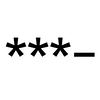</td>
    <td><a href="https://thenounproject.com/icon/password-139974/">password</a>, by ochre7</td>
  </tr>
</table>

[subscriptions]: https://thenounproject.com/pricing/
[license]: https://thenounproject.com/legal/terms-of-use/#icon-licenses
