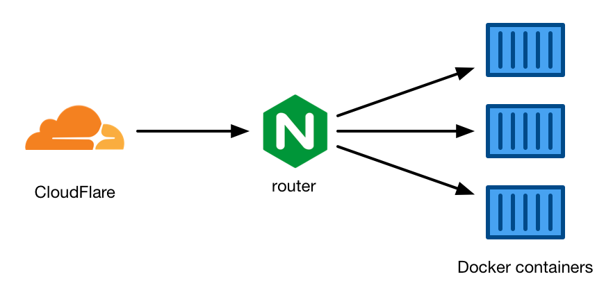

# infra

This folder contains files for the site infrastructure.

The entire site runs as a series of Docker containers on a Linode VPS.

I run CloudFlare in front of the site for caching and a CDN.
Uncached requests go first to an nginx container, which routes them to the appropriate Docker container: one for the main site, some Flask apps, my analytics app, and so on.

`docker-compose.yml` defines the containers that are run (not all of which are defined in this repository).

`nginx.conf` is the nginx config for the router container.
