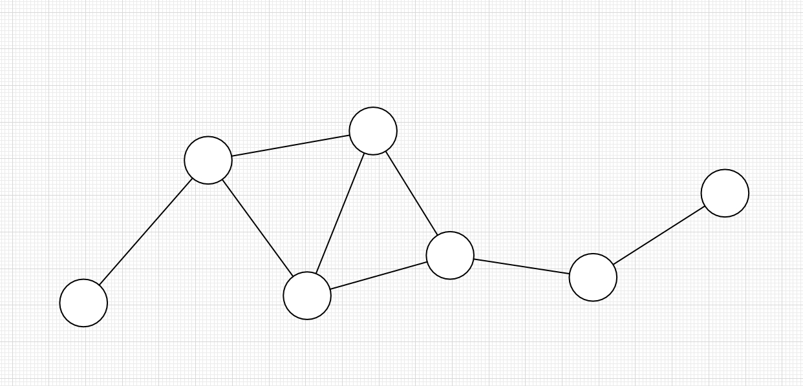
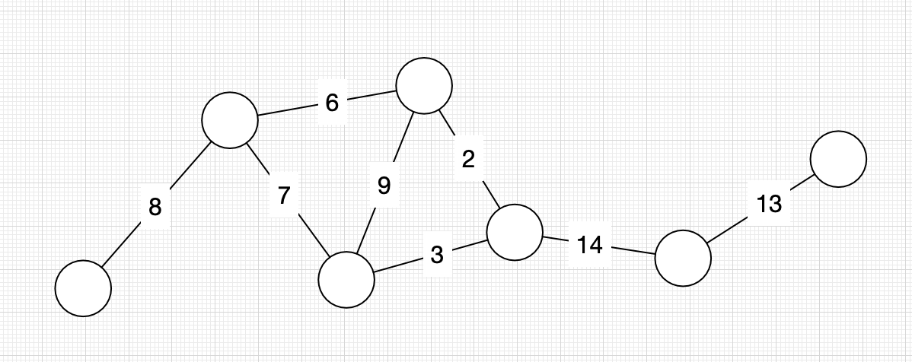
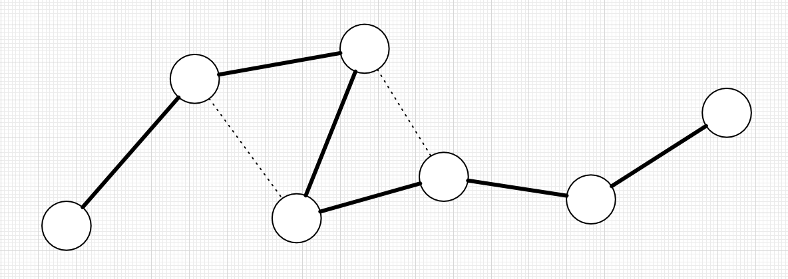
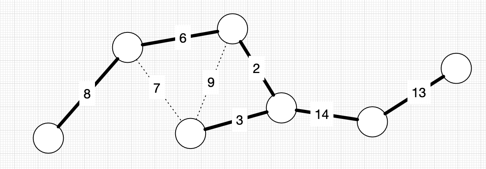

A couple of weeks ago, I went to see my sister playing percussion in a brass band [at the Proms][late_prom].
While I was on the train home, I had an idea for a fun art project.
I sketched it out on a napkin, got it working, posted a few pictures on Twitter, then ran out of time.

Today I'm sitting in the foyer of the Birmingham Symphony Hall, waiting to watch her play in another band at [the British Open][open].
I finally have some time to revisit those ideas, and write them up properly.

(There's a lesson here about how art begets more art.)

These are a few of the pictures I was able to make:

In this post, I'm going to explain my ideas and thinking, and share the code I used to make them.

[late_prom]: https://www.theguardian.com/music/2022/aug/13/bbc-proms-30-32-tredegar-band-review-hms-pinafore-opera-holland-park-ohp-poulenc-double-bill-glyndebourne
[open]: https://www.4barsrest.com/news/54320/bands-ready-for-british-open-return

## The background theory

This project is based on an idea from [graph theory].
If you already know what a *minimum spanning tree* is, you can skip to the next section.
If not, read on.

In maths, a *graph* is a structure made up of *vertices* (also called points or nodes) and *edges* (links or lines).
It represents the relationship between pairs of points.

For example, you could use a graph to model the paths between some towns.
The towns are the vertices, and the paths are the edges.

If you assign a weight or cost to each edge, it becomes a *weighted graph*.
This could represent, say, the time it takes to walk along each path.

A *spanning tree* is a subgraph that connects every vertex to every other vertex, and which doesn't contain any loops.
This is a "minimally connected" version of the graph -- if you removed any more edges, there would be vertices that are no longer connected.

A single graph may have multiple spanning trees.

A [*minimum spanning tree*][mst] is a spanning tree of a weighted graph that minimises the total weight of all the edges.

There are lots of practical uses for minimum spanning trees.

For example, if you wanted to connect your towns by roads, you might start by building along the minimum spanning tree.
It connects all the towns but minimises the total cost of your new road network.

There are plenty of algorithms for finding minimum spanning trees, which I'm not going to explain here.
For this project, I used the [networkx library], which includes implementations of several such algorithms -- I used those rather than writing my own.

[graph theory]: https://en.wikipedia.org/wiki/Graph_theory
[mst]: https://en.wikipedia.org/wiki/Minimum_spanning_tree
[networkx library]: https://pypi.org/project/networkx/

## The idea

This is my basic idea:

1.  Take an input graph
2.  Assign random weights to its edges
3.  Find a minimum spanning tree

By picking different input graphs, I thought I could make some interesting pictures.

## Input graph #1: a square lattice

My initial napkin sketch had a [square lattice].
These are some of the pictures I was able to make:

When I shared them on Twitter, somebody compared them to the characters of a [conlang ("constructed language")][conlang].
I quite liked the comparison, so I drew another batch with an earthy brown and varying stroke widths:

To me, this second set feels vaguely evocative of Chinese characters.

[conlang]: https://en.wikipedia.org/wiki/Constructed_language
[square lattice]: https://en.wikipedia.org/wiki/Square_lattice

## Input graph #2: triangular lattice

I drew my square lattices using a networkx function called `grid_2d_graph`; I tried a similar-sounding function called [`triangular_lattice_graph`][tri_lattice].

That gave me a set of patterns that felt evocative of creeping vines on a wall, so I coloured them green:

[tri_lattice]: https://networkx.org/documentation/stable/reference/generated/networkx.generators.lattice.triangular_lattice_graph.html?highlight=triangular+lattice#networkx.generators.lattice.triangular_lattice_graph

## Input graph #3: radial lattice

I wanted to try using spiderweb-like diagrams as the input; I thought they'd look fun:

Initially I fixed the number of rings at 4, and let the number of spokes vary.
It took a bit more time to work out the bugs, but I really like the results.

Then I added even more randomness: varying the number of rings, the colour, and the stroke width.
These are a few of my favourites:

I especially like the blue hexagon, which feels like the topdown view of some sort of seafaring vessel.

## Input graph #4: radial lattice with curves

As you crank up the number of spokes in a radial lattice, it starts to approximate a circle -- so what if I could actually do proper curves in the lattice?
This took a bit more work, which ended up [as a separate post][curved_arcs].

Honourable mention to these image, which was created when I didn't set a `fill` attribute properly.
I didn't take this any further, but the opportunity for slices of a second colour feels like an interesting idea to explore.

Once I had the code for curves working, adding it to the radial lattice was fairly straightforward.
I had a lot of fun generating these images.
I also played with the idea of removing the central vertex, and having an "open" core.

These feel like designs out of science-fiction: the red circles feels evocative of radiation warnings, and several of them look like radar scanning screens (especially the teal).
As the spoke count increases, some of them feel like large mazes.
The thin yellow lines is one of my favourites, because it reminds me of a key hole.

[curved_arcs]: /2022/08/circle-party/

## Input graph #5: radial lattice with convave curves

For a final variation, I tried using concave curves in the lattice.
This matches the spider-web emoji, where the individual arcs bend towards the centre of the circle, rather than outward.

This got even more fun when I allowed arcs to bend alternately in and out, creating some extremely funky patterns.
(I think there are also a few images here where I mixed in code to randomly delete nodes in the input graphs, which is why there are a few gaps.)

At one point I had this running in a background window, generating a new image every thirty seconds, which made for a fun bit of decoration.

## Further ideas

I have a bunch more thoughts for what I could do next, although I have no immediate plans to do so -- I proved the initial idea is workable, and I got some pretty pictures.
That's enough for now.

The only limit here is the graphs you start with: the stranger the input, the stranger the output.
Here I've worked exclusively with uniform lattice graphs, but this technique should be usable on any graph.

I did consider adding markers to the leaf nodes (the end of lines), to make them look more like traditional graph illustrations.

I mentioned earlier that some of the patterns look like the walls of a maze.
These wouldn't actually work as mazes, but it feels like this isn't too far from a maze generator.
Maybe if you used this to create the negative space, not the walls?

the code is on github, tho most of it is for
