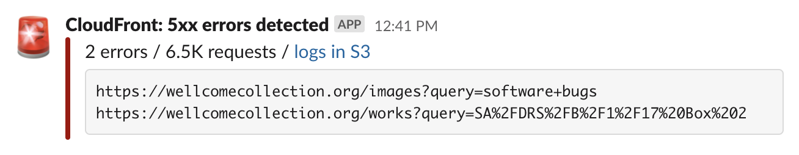
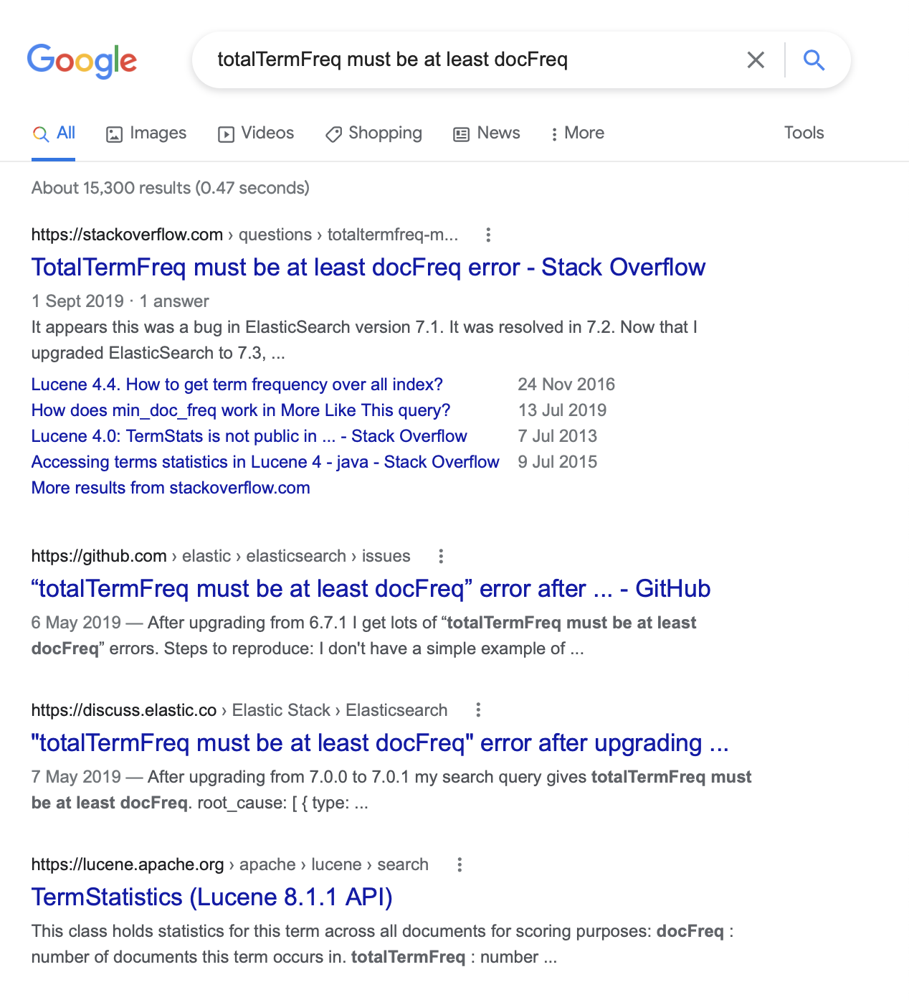
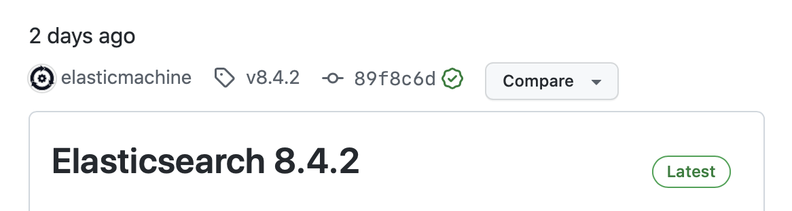
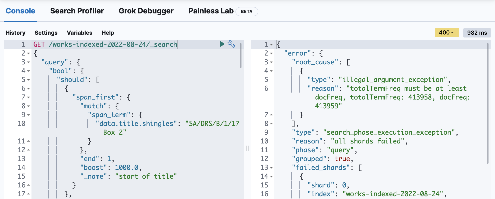

Last week, I helped to find a bug in Elasticsearch 8.4.2.
We started seeing issues in our Elastic cluster at work, and through some debugging I was able to create a [reproducible test case][repro].
I'm pretty pleased with the repro, which helped Elastic's engineers identify and fix the bug -- and which will be [patched in 8.4.3][843].

I thought it might be interesting to walk through the debugging process; to explain my thinking and my steps.
Every bug is different, but the same techniques appear again and again.

This is going to be an in-depth technical post; grab a drink before you start.

## Uh oh, something's up

This is our basic architecture:


When you browse our [online collections], you're using a front-end web app that makes requests to our [Catalogue API][catalogue].
This API is making queries against an Elasticsearch cluster, hosted in Elastic Cloud, which is where the data lives.

On Thursday, we started getting alerts from our front-end monitoring that a small number of searches were failing with 500 errors:



We run CloudFront in front of the website, and we upload our logs to an S3 bucket.
There's a Lambda that listens to new uploads in that bucket, and scans every log file as it's uploaded.
If it sees 5xx errors, it posts [an alert to Slack][slack_alerts] which includes a list of failing URLs.

When we opened the affected URLs, we saw the searches fail -- if a search was failing, it would fail persistently, but some searches would succeed.
For example, searches for *"SA/DRS/B/1/17 Box&nbsp;2"* were failing, but searches for *"bolivia"* were succeeding.

Something had gone bang.

## Where's the problem coming from?

I looked at the application logs for the front-end web app, and I could see it was forwarding a 500 error from the catalogue API.
I looked at the logs for the catalogue API, and I could see it was forwarding an unexpected error from Elasticsearch:

> Unknown error in search phase execution: ElasticError(illegal_argument_exception,totalTermFreq must be at least docFreq, totalTermFreq: 11966, docFreq: 11967, …

This suggested that the fault was either in Elasticsearch itself, or in the way we were querying Elasticsearch.

(Aside: after this incident, we tweaked the logging in both applications.
Both would say *"I got a 500 error from the upstream service"*, but wouldn't tell you how to reproduce the error.
For future 500 errors, the front-end app now records the catalogue API query it tried, and the catalogue API now logs the Elasticsearch query it made.)

I'd never seen this error before, so I plugged it into Google.
The lack of results from people experiencing the same error was… unusual:



Seeing that people had had this issue when upgrading Elasticsearch made me remember that I'd just upgraded our Elasticsearch instance from 8.4.1 to 8.4.2.

(This wasn't deliberate; it was carelessness.
We manage our Elastic Cloud clusters in Terraform and tell them to use the latest version of 8.4.x.
I'd been making some unrelated Terraform changes, and upgraded the cluster at the same time.
We've now changed this Terraform so that it won't upgrade clusters after they're created.
Once a cluster is created, it stays on the same version until manually upgraded.)

Then I looked at the [list of Elasticsearch releases][releases]: 8.4.2 had been released just two days prior.



Uh oh.

This is the first time I suspected this might be an Elasticsearch bug.
I'm usually loathe to point the finger at upstream providers – while nobody is infalliable, these are services with plenty of users.
Most bugs are going to be spotted by somebody else before they affect us.
If something has gone wrong that isn't affecting anybody else, it's more likely my mistake than theirs.

But how many people would have upgraded within 48 hours of release?
Maybe we were among the first users to hit this bug.

The 8.4.2 release was the obvious culprit, so we started a rollback plan.
We created a new cluster on an older Elasticsearch version and began loading in our data, so we could point our API away from the broken instance.
This stopped the errors, and it would have been enough.

I could have stopped here, and let somebody else find the bug -- but it had got under my skin.
I was going to hunt it down.

## Comparing two versions of Elasticsearch

If I wanted to prove this was a bug introduced in 8.4.2, I had to do two things:

1.  Show that the error doesn't occur in 8.4.1
2.  Show that the error does occur in 8.4.2

We use [Elasticsearch Docker images][docker] for CI/CD, and I knew they were published for every version.
I pulled two images to my local machine, which I could start to get two different versions:

```console
$ docker pull docker.elastic.co/elasticsearch/elasticsearch:8.4.1
$ docker pull docker.elastic.co/elasticsearch/elasticsearch:8.4.2
```

Now I needed to fill them with data.
there are three variables to consider:

*   the mapping, which tells ES how to index the different fields
*   the documents -- what data are we storing?
*   the query -- how are we searching ES

in the failing catalogue API query, these are all large and unwieldy
wanted to reduce to minimal versions

## Getting a minimal query

started in kibana dev tools, no setup required

In the dev tools in Kibana, there's a console where you can try API queries.
I tried the query the API was making, and bam, I got the same error:



I don't really understand what the query does or how it works, but I didn't need to – I just started deleting bits, re-ran the query, and checked to see if I still got an error.
Together a colleague and I managed to reduce a 150+ line query down to this:

```http
GET /works-indexed-2022-08-24/_search
{
  "query": {
    "bool": {
      "should": [
        {
          "multi_match": {
            "query": "1",
            "fields": [
              "data.physicalDescription",
              "data.edition",
              "data.notes.contents"
            ],
            "type": "cross_fields",
            "operator": "And",
            "_name": "data"
          }
        }
      ]
    }
  }
}
```

Although this was only part of the reproduction, it was a useful clue: in particular, it helped identify the handful of fields that were actually interesting.

The original index is ~50GB, but if I could reduce it to the three fields in this query, I'd have something much smaller – and maybe something I could share.

## Getting a minimal set of documents

The [last time somebody had this issue](https://github.com/elastic/elasticsearch/issues/41934), they had difficulty creating a reproduction:

> I don't have a simple example of how to reproduce because it only happens when I index tons of data.

They don't say explicitly, but I suspect "give Elastic engineers a complete copy of the index" wasn't an option -- for most users, their databases contain proprietary information they can't just give away.

Fortunately for me, all the data in our catalogue index is publicly available and permissively licensed.
There are no rights issues with sharing the data (we have [snapshots for download][snapshots]), so I knew that if I could get a working reproduction, I could share the data.

Our API index spans ~3M documents and ~50GB of storage.
That's pretty small by Elasticsearch standards, but still way too big to share.

I started with a Python script to download the index:

```python
with open("documents.json", "w") as outfile:
    for hit in scan(
        es,
        scroll="1m",
        _source=["data.physicalDescription", "data.edition", "data.notes.contents"],
        index="works-indexed-2022-08-24",
    ):
        outfile.write(json.dumps(hit) + "\n")
```

Notice that I selected a subset of fields with the `_source` argument -- just the fields in the minimal query.
(I suppose it's possible that a non-queried field could affect the result, but that would be very bizarre!)

This alone made a big saving -- the file it created was ~600MB.

So now I had a moderately-sized set of documents, and a query to try with them.
How do I test it?


## A local debugging loop

i wrote another python script to load some data in the index and check for the error.
it would:

1.  create an index with a random name
2.  apply a mapping to the index
3.  index all the documents
4.  run a query the index, see if it errors

I could use this with the minimal query I'd already found, and the data set I'd created, and test against both versions of ES

I did have to do some deleting in the mapping, to simplify it.
our index mapping has a lot of extra analysers and fields (e.g. to analyse titles in multiple languages) which I suspected didn't affect the error -- I gradually deleted bits of the mapping and re-ran this script, checking the error kept occurring

by running this script repeatedly, I could see the error occurring on 8.4.2 and not 8.4.1 - precisely what you'd expect if it was a newly-introduced bug
i tried some other changes ot reduce the size of the data set, like reducing the number of documents -- but they made the error intermittent on 8.4.2
it surely doesn't take 900k documents to repro this issue,

used tools like grep and head to try to reduce document set

this is when I stopped and started writing up an issue on the elastic repo

## lessons learned

this write-up makes it seem like a more deliberate and intentional process than it actually was
debugging isn't linear
but some useful lessons here

*   key was the script to create an index, load it up with documents, run the query. gave me a fast feedback loop on whether i'd reduced too far

*   probably should have opened ES issue sooner
    "i've found this issue, working on a repro"
    would have saved me time if somebody else already had it; would have saved elastic time trying to get thier own repros

*   always be logging, always find ways to make it easier to debug next time
    in particular, not being able to easily get ES query slowed me down


[online collections]: https://wellcomecollection.org/collections
[catalogue]: https://developers.wellcomecollection.org/docs/catalogue
[slack_alerts]: https://stacks.wellcomecollection.org/getting-helpful-cloudwatch-alarms-in-slack-ba98fcbe6d31
[repro]: https://github.com/elastic/elasticsearch/issues/90275
[843]: https://www.elastic.co/guide/en/elasticsearch/reference/8.4/release-notes-8.4.2.html#known-issues-8.4.2
[fe_app]: https://wellcomecollection.org/works
[releases]: https://github.com/elastic/elasticsearch/releases
[snapshots]: https://developers.wellcomecollection.org/docs/datasets
[docker]: https://www.docker.elastic.co/r/elasticsearch
